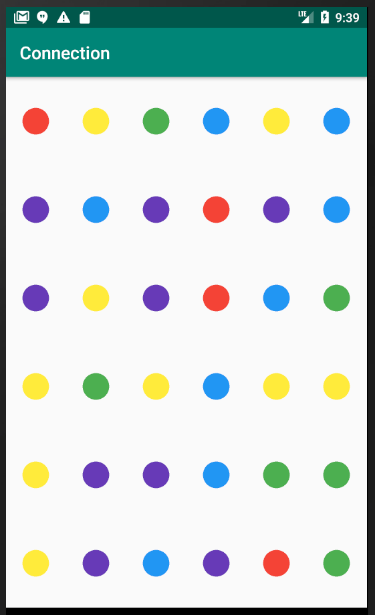

# COP 3665 - Mobile Programming

# Project 3 - Making Connections

## Objective:

This is an optional third project that can be completed to replace one of the two previous projects of the course. This project focuses on custom views and adding touch events.  

## Problem Description:

You are tasked to create a game that uses some of the same concepts from popular games like Candy Crush and Bejeweled. You will be focusing on how connections are made between objects in the game, however it is left as an optional challenge for you to fill in the last remaining step. 

## Overview:

You will have a single activity, a fragment, and a custom view in the game. This project should demonstrate how each of these parts layer on top of each other. There are multiple ways to design Android applications, but they are all made with some combination or subset of the three (activities are always needed if your application has a view). The final application will appear as such: 


The grid of dots comprises your custom game view. This view will handle interactions for a player that will try to make connections between dots of the same color. Players will get points based on the size of the connection they make. The more connections they can make within the time limit, the better. Due to the number of parts involved in this application, you are provided with a stepwise guide to developing the application. Do not however that some parts are intentionally absent for you to research and figure out on your own. 

### Sample run of program

The image below links to a [video](https://youtu.be/fw29hDcxMTs) of a sample execution of the program solution.

[](https://youtu.be/fw29hDcxMTs)

### Stepwise Refinement

It is strongly recommended that you follow the steps in order, as they are designed to give you a structured approach to accomplishing the project. 

1. Start by creating two model classes (you will extend these classes as you go): 

    - A Dot class - The Dot class should contain specifics about an individual Dot, such as the color (use an int to represent a color), row, column, center position (as floats for X and Y), and a radius for the Dot. Make sure to add getters and setters for each. In addition, you will want to have a method that can randomly select an integer for the color and set it for the Dot. Let the number of colors be determined by a NUM_COLORS constant in the ConnectionGame class.

    - A ConnectionGame class - This class will use the Singleton pattern so go ahead and setup the getInstance method. This class needs to track the state of the game. Setup a two dimensional array of Dots, have a constructor that initializes this array, a method that fetches a Dot from the array, and at least a newGame method that can intialize every Dot in the array to a new color by using the method you created in the Dot class.

2. You will have three classes that are part of the controllers and views (you will extend the last two classes as 
you go):

    - A MainActivity - The only need for this class is to hold the GameFragment, so you can follow the SingleFragmentActivity pattern.

    - A GameFragment - For now you just want a newInstance, onCreate, and onCreateView. The onCreate should start a new game, and the onCreateView should inflate your layout (which you will create soon).

    - A GameView class - This will be a custom view, so refer to the course material to remember how to create a custom view. Be sure to add the appropriate constructors (keep things basic for now).

3. Create the resource values you will use. 

    For colors.xml, include the addition of the below array:
    ```
      <array name="dotColors">
          <item>#F44336</item>
          <item>#2196F3</item>
          <item>#4CAF50</item>
          <item>#FFEB3B</item>
          <item>#673AB7</item>
      </array>
    ```
    For strings.xml, include the following additional strings:  
    ```
      <string name="new_game">New Game</string>
      <string name="score">Score</string>
      <string name="timer">Time</string>
    ```
4. Create a layout for your fragment. Initially, it should only have a GameView component. Go ahead and run your code to ensure everything loads properly (it will be a toolbar and blank screen).

5. In this step, get the dots to show on the screen (see picture below). Doing this will require you to draw circles into the cells of an invisible grid (imagine a grid drawn on your screen where each cell contains one of the Dots in the center of the cell).


    

    In your constructor, start by setting up a Paint object to use for dots and also get the array of colors you put in colors.xml (you can do this with getResources().getIntArray(R.array.dotColors)). You will need to know the width and height of each cell in the grid which can be found by dividing the width and height of the GameView by the number of cells in each row and column. You can only get the width and heightafter the view has been sized, so you will need to override the method "void onSizeChanged(int width, int height, int oldWidth, int oldHeight)".Once you have the height and width of each cell, you can pass over each Dot in the game and set its center X and Y (e.g., the center X position for a Dot in column 1 should be 1 * mCellWidth + (mCellWidth / 2),  and similar for Y). Also set the radius of each Dot to 40.

    Once you have set the positions and radius for each Dot, you can now create an onDraw method. Get it to draw each Dot by looping over all Dots in the game (what should have been initialized in the ConnectionGame class) and using the canvas to draw circles (drawCircle) using the X, Y, radius, and the Paint you setup earlier. The color of the Paint will come from getting the integer you randomly set for the Dot's color and then finding the corresponding color for that integer from the dotColors array. 

    Run your program and ensure that you are able to draw all the Dots. 

6. In this step, start creating connections (see picture below) between selected Dots. To do this, you will need to extend your model classes. Extend the Dot class so that it keeps track of whether it is selected or not. Also, add another method to the Dot class to figure out whether it is adjacent to another Dot that you pass in (Dots are adjacent if they are to the left, bottom, top, or right of another Dot). Extend your DotsGame class so that it keeps track of the Dots that are currently selected. You want to be able to get the list of selected Dots, add to the list, and clear the list. Be careful when adding Dots, you want to only add them if they are valid selections (adjacent and same color).

    

    You are going to need two parts to get this working. You will need to override onTouchEvent to allow it to identify what Dots are being selected, and then you will need to modify onDraw so that it draws a Path between the selected Dots. You can identify Dots in your onTouchEvent by using the MotionEvent to get the touched X and Y coordinates on the screen, and then identifying the row and column that would correspond to those coordinates (remember the invisible grid!). If the Dot is a valid addition, then go ahead and add it to your selected Dots. Make sure that you clear the selected Dots when the user lifts their finger, and call invalidate() at the end of the method (so onDraw is triggered).

    To extend onDraw, you can use the canvas's drawPath method. To do this, you create a new Path, move the start of the Path to the first selected Dot's center and then add lines in the path to each other selected Dot's center (as help, look at the Path's moveTo and lineTo methods). Draw the path using a path with the style of STROKE, a stroke width of 10, and the color of the selected dots.

    Run your program and ensure that you are able to properly draw paths between Dots.      

7. For this step, go ahead and make the fragment's layout similar to the layout shown in the video. Make sure that you use separate TextViews for labels and numbers as things will have to be updated by the program later. Extend the ConnectionGame to keep track of the current score and go ahead and make sure that the score will show in the fragment (initially a game should have a score of 0). Also get the New Game button working by creating a new game, invalidating the current GameView (you will need to get the game component in the fragment and then call invalidate on it) and updating the score back to 0 (set up a method to update the score).

    Go ahead and run this to make sure that you see a score of 0 and when clicking the New Game button the Dots change color (this should be handled by the newGame method in your ConnectionGame class that you were told to create earlier). 

8. Time to get the score working. In order to do this, your fragment will need to know that a connection has been made. The easiest way to do this is through Callbacks similar to how we did this between fragments and activities. In your GameView, create an interface for a GameListener that has a single method that will get called whenever a touch event occurs. The method will need to take in whether the selection was completed as a boolean. Create an instance variable for a GameListener in GameView and a method called setGameListener to take one in. In your onTouchEvent, call this method with false whenever anything other than an ACTION_UP occurs, and send true if ACTION_UP occured. Your fragment should create and pass in a GameListener to your view. This GameListener should check for whether a selection was completed and tell the game to update the score if more than 1 Dot is involved in the selection. Make sure to update the score on screen as well. The player should get 1 point for every Dot involved in the Connection.  

    Run your program and verify that the score gets updated whenever a connection is made. 

9. We need an ending condition, so let us add a timer. The player will have until time runs out to make as many conditions as possible. Have your game hold a remaining time. It should start at 10 seconds and the game is over when the time reaches 0. You will need a CountDownTimer in your Fragment. You can find how to use CountDownTimer here (https://developer.android.com/reference/android/os/CountDownTimer). This timer should update the remaining time in the game and on the screen. Start the timer whenever a touch event occurs (use the GameListener from the previous step). Players should not be able to make any additional selections after time is out. Do not forget to reset the time in a new game.

    Run your application and you should have a working "game", but it has one problem. The player can make the same connection multiple times. Fixing this is done with the optional tenth step. 

10. (Optional) This one is optional, but gives another dimension to the game. Most games of this nature have a few extra polishes. One nice addition would be to add a set of animations that remove previously connected Dots and drops new Dots into their place. You should look into ValueAnimators to do this and multiple animations will be needed to make this look as good as possible. Also try to freshen things up a bit. Add sounds and use themes to make the game more appealing overall.


## Additional Requirements:

Your application must function as described below:

1. Your program must adhere to the all requirements provided in this description.
2. Your program must perform the functionality displayed in the video.
3. Any constants should be kept inside their appropriate xml files (this includes strings and colors). 

## Important Notes:

- Projects will be graded on whether they correctly solve the problem, and whether they adhere to good programming practices.
- Projects must be received by the time specified on the due date. Projects received after that time will get a grade of zero.
- Do not change any of the files given to you unless told to. 
- Please review the academic honesty policy.
  - Note that viewing another student's solution, whether in whole or in part, is considered academic dishonesty.
  - Also note that submitting code obtained through the Internet or other sources, whether in whole or in part, is considered academic dishonesty. 

## Submission Instructions:

1. All code must be added and committed to your local git repository.
2. All code must be pushed to the GitHub repository created when you "accepted" the assignment.
   1. After pushing, visit the web URL of your repository to verify that your code is there.
      If you don't see the code there, then we can't see it either.
3. Your code must compile and run in a Nexus 5X emulator with API 24 or it might not be graded.
   1. If your program will not compile, the graders will not be responsible for trying to test it.
